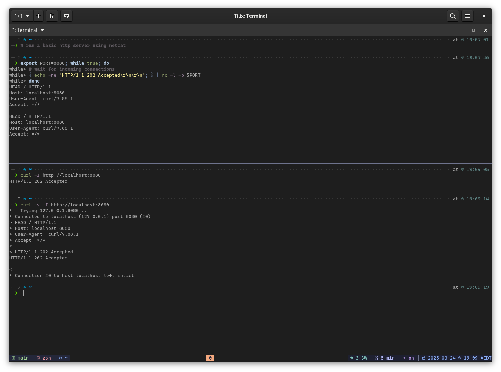

# debian-dev-machine-setup | Debian 12

## Description

This repository contains Ansible playbooks to configure a system as a development machine after a clean install.

The playbooks are designed for Debian-based systems with minimal modifications but have only been tested on:

- **Debian 12/Bookworm (stable)**

The screenshot below shows the *p10k zsh theme with tmux*:



---

## What Gets Installed and Configured?

As a DevSecOps Engineer, I work daily with tools like AWS, Docker, Ansible, and Terraform. If you’re in a similar profession, this setup will likely meet your needs. The system is also easily extensible using Ansible roles.

Below is a summary of the packages installed and configured, organized by roles:

- **role: base**
  - Mounts `/tmp` on tmpfs to reduce SSD read/write operations and extend SSD lifespan, with no leftover files on system shutdown.
  - Sets the default system editor to Vim instead of Nano.
  - Enables the UFW firewall and installs the GUFW graphical frontend.
  - Tunes system swappiness to minimize swapping.
  - Upgrades all system packages.
  - Installs archiving tools like `zip`, `rar`, and others.
  - Installs LibreOffice.
  - Installs Foliate (an e-book reader) and markdown viewers/editors like Glow, Apostrophe, and Obsidian.
  - Installs power management tools like [TLP](https://github.com/linrunner/TLP).
  - Installs development tools such as `android-tools`, `awscli`, `httpie`, `clusterssh`, `docker`, `filezilla`, `golang`, `poetry`, and more.
  - Installs Nala, an alternative package management tool to `apt`/`apt-get`.
  - Installs code formatters and linters like `black`, `ruff`, and `ansible-lint`.
  - Sets up Go programming language directories.
  - Installs download tools like `axel`, `transmission`, `wget`, and `aria2`.
  - Installs image, audio, and video tools like `vlc`, `totem`, `gimp`, and `imagemagick`.
  - Installs virtualization tools like VirtualBox, Docker, and Docker Compose.
  - Optionally enables night light settings for eye comfort (set `base_permanent_night_light.night_light_enabled` to `True`).
  - Enables `fzf` fuzzy finder in the Zsh terminal; see this [YouTube video](https://www.youtube.com/watch?v=1a5NiMhqAR0) for usage instructions.
- **role: hashicorp**
  - Installs Vagrant, Terraform, and Packer.
- **role: terminal_customizations**
  - Downloads and installs Nerd Fonts from [ryanoasis/nerd-fonts](https://github.com/ryanoasis/nerd-fonts), ideal for terminals and programming editors.
  - Copies and enables a sample Tilix configuration file with a configured Nerd Font.
  - Copies and enables a sample `~/.tmux.conf` file with the [Tmux Plugin Manager](https://github.com/tmux-plugins/tpm) and several Tmux plugins if one does not exist.
    - Open Tilix and run the `tmux` command, or enable the custom command option in Tilix.
    - Edit `~/.tmux.conf` as needed.
- **role: vim**
  - Installs Vim packages.
  - Installs the [amix/vimrc](https://github.com/amix/vimrc) Vim distribution.
  - Creates a sample Vim customization file at `~/.vim_runtime/my_configs.vim`.
    - Additional Vim settings are enabled in `~/.vim_runtime/my_configs.vim`, which are not part of the Vim distribution. Edit this file as needed.
- **role: zsh**
  - Installs the Zsh package and sets it as the user’s default shell.
  - Installs the Antigen Zsh plugin manager.
  - Copies and enables a sample `~/.zshrc` file if one does not exist, including:
    - A function to prevent `ssh-agent` from repeatedly prompting for encrypted SSH key passwords when opening new terminals.
    - Additional shell aliases, functions, and variables in `~/.shell_aliases.sh`, `~/.shell_functions.sh`, and `~/.shell_variables.sh`.
  - Installs [ohmyzsh](https://github.com/ohmyzsh/ohmyzsh) and enables select bundled plugins.
  - Enables the Bullet Train Zsh theme (other themes like Powerlevel10k can also be configured).
- **role: firefox**
  - Adds the Mozilla Firefox APT repository.
  - Installs the latest version of Firefox (the bundled ESR version in Debian is outdated).
    - Use the command `apt-cache policy firefox firefox-esr` to verify which repository is used for updates.
- **role: googlechrome**
  - Adds the Google Chrome APT repository.
  - Installs Google Chrome.
- **role: vscode**
  - Adds the Visual Studio Code APT repository.
  - Installs Visual Studio Code.
  - Installs popular Visual Studio Code extensions.
- **role: privacy**
  - Installs Tor.
  - Configures Tor to run at boot and excludes certain countries as exit nodes.
    - Edit `/etc/tor/torrc` as needed.
  - Installs ProxyChains.
  - Configures ProxyChains to use Tor; see [my Medium story](https://fazlearefin.medium.com/tunneling-traffic-over-tor-network-using-proxychains-34c77ec32c0f) for usage instructions.
    - Edit `/etc/proxychains4.conf` as needed.
  - Installs the Metadata Anonymization Toolkit.
- **role: security**
  - Installs ClamAV (antivirus) and its GNOME interface. Perform manual scans from Nautilus or the CLI using `clamscan` (`clamd` is not installed due to its high memory usage).
  - Installs Firejail for sandboxing applications.
  - Enables additional AppArmor profiles.

---

## Step 0 | Prerequisites for Running the Ansible Playbooks

On the system to be configured, perform the following steps.

Install `ansible` and `git` using either `pip` or `apt`:

```bash
sudo apt update
sudo apt full-upgrade -y
sudo apt install ansible git -y
```

Clone this repository (avoid cloning into `/tmp`, as it is cleaned and mounted on tmpfs):

```bash
git clone https://github.com/fazlearefin/debian-dev-machine-setup.git
cd debian-dev-machine-setup
```

## Step 1 | Running the Playbooks to Configure Your System

Run the following command as the primary user of the system, **not as `root`**:

```bash
ansible-playbook main.yml -vv -e "{ laptop_mode: True }" -e "local_username=$(id -un)" -K
```

Enter the sudo password when prompted for `BECOME password:`.

The `main.yml` playbook may take 15 minutes to an hour to complete.

After completion, reboot your system to apply all changes.

> ### What is `laptop_mode`?

#### Setting `laptop_mode` to `True`
- Installs battery-saving packages like [TLP](https://github.com/linrunner/TLP).

#### Setting `laptop_mode` to `False`
- Skips battery-saving packages like [TLP](https://github.com/linrunner/TLP).

---

## Known Issues

- If the Ansible playbook halts after completing some tasks, rerun it. Most tasks are idempotent, so running the playbook multiple times will not cause issues.
- If your terminal displays garbled characters due to a Zsh theme, change the terminal font to a suitable Nerd Font in the terminal settings.
- To disable fuzzy finder completions, comment out or remove the `#fzf` lines in `~/.zshrc` (this is a feature, not an issue).
- Enabling certain [ohmyzsh](https://github.com/ohmyzsh/ohmyzsh) plugins, like **docker**, may result in an error: `tee: <snip> No such file or directory`. Fix this by creating the missing directory: `mkdir -p ~/.antigen/bundles/robbyrussell/oh-my-zsh/cache/completions`.

---

## Pull Requests and Forks

Pull requests are welcome, but this repository is tailored to my development needs. For personalization, consider forking the repository to suit your requirements.

---

## Donations

If this project saves you time and effort, feel free to make a donation. The code is completely free with *no strings attached*.

Bitcoin (BTC): `bc1qzlhpm94vtk2ht67etdutzcy2g5an5v6g36tp0m`
